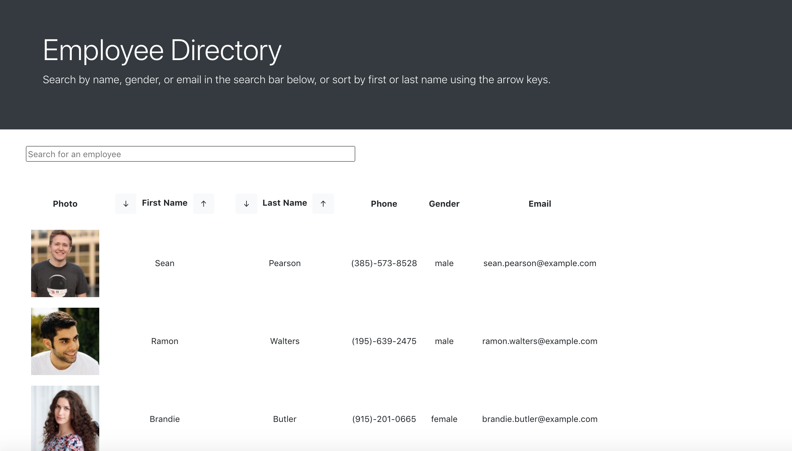
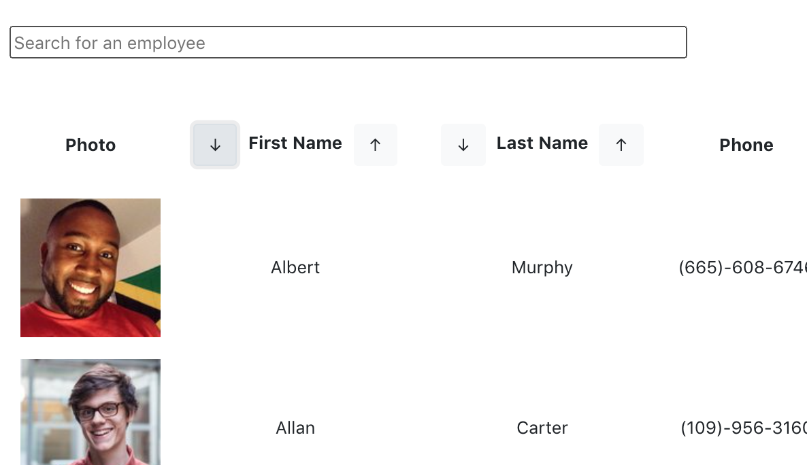

# Employee Directory

# Description

This React application pulls in random "employee" data from an API, and dynamically displays those employees' information on the page. It allows for the user to search employees by name, gender, or email address, as well as to sort alphabetically and reverse-alphabetically by first or last name.

The deployed application can be found here: [Employee Directory](https://skerr924.github.io/employee-directory/)

# Table of Contents

- [Description](#description)
- [Table of Contents](#table-of-contents)
- [Usage](#usage)
- [Contributing](#contributing)

# Usage

This application is designed to be simple and user-friendly, with just one main user interface pulling from various React components. It employs the [randomuser.me](https://randomuser.me/) API for the random user data, which is called every time the application is reloaded.

Home page: 

Search and alphabetize features: 

# Contributing

When contributing to this project, please add clear and concise comments to all added code to ensure my and future users' understanding of additions and changes.

This app was built by Sarah Kerr, sarah.kerr93@gmail.com
